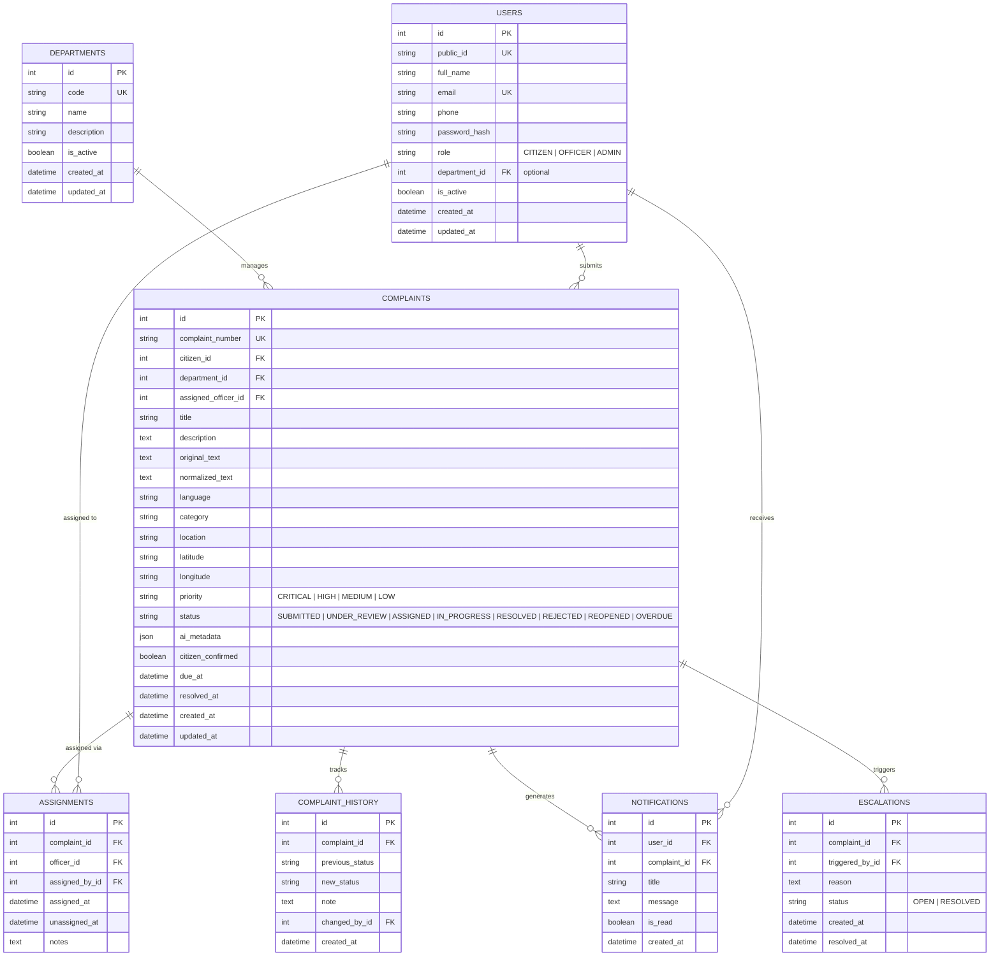

# VoxentraAI Database Architecture

## 1. Overview
The database uses SQLAlchemy 2.0 with declarative mapping. It runs on **SQLite** for local development and is fully compatible with **PostgreSQL** in production without schema modifications.

---

## 2. Entity-Relationship Schema

---

## 3. Allowed Status Transitions

| Current Status | Allowed Next Statuses | Permitted Roles |
|---|---|---|
| `SUBMITTED` | `UNDER_REVIEW`, `ASSIGNED`, `REJECTED` | Officer, Admin |
| `UNDER_REVIEW` | `ASSIGNED`, `IN_PROGRESS`, `REJECTED` | Officer, Admin |
| `ASSIGNED` | `IN_PROGRESS`, `REJECTED` | Officer, Admin |
| `IN_PROGRESS` | `RESOLVED`, `REJECTED` | Officer, Admin |
| `RESOLVED` | `REOPENED` | Citizen (own complaint), Admin |
| `REJECTED` | `REOPENED` | Citizen (own complaint), Admin |
| `REOPENED` | `UNDER_REVIEW`, `ASSIGNED`, `IN_PROGRESS` | Officer, Admin |
| Any Status | `OVERDUE` | System Cron / Officer / Admin |
